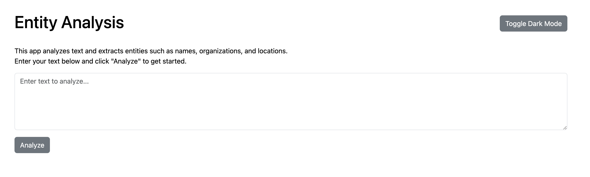

<a id="readme-top"></a>

<!-- ABOUT THE PROJECT -->
## About Entity Analysis App

[](static/text_analysis_page.png)

Entity Analysis is a web application that analyzes text for entities using the IBM Watson Natural Language Understanding (NLU) API. The app features a Bootstrap-based user interface with dark mode functionality. The web application is developed using Flask for a Robust REST API.


### Key Features:
- ✅ Submit text for entity analysis.
- ✅ Responsive and modern user interface built with Bootstrap.
- ✅ Toggle between light and dark themes.
- ✅ User-friendly error messages for API failures.
- ✅ Spinner displayed during API processing


<p align="right">(<a href="#readme-top">back to top</a>)</p>

<!-- TABLE OF CONTENTS -->
<details>
  <summary>Table of Contents</summary>
  <ol>
    <li>
      <a href="#about-the-project">About The Project</a>
      <ul>
        <li><a href="#built-with">Built With</a></li>
      </ul>
    </li>
    <li>
      <a href="#getting-started">Getting Started</a>
      <ul>
        <li><a href="#prerequisites">Prerequisites</a></li>
        <li><a href="#installation">Installation</a></li>
      </ul>
    </li>
    <li><a href="#license">License</a></li>

  </ol>
</details>

## Built With

This project was built with:

### Frontend
- Python - Backend logic and API integration.
- Flask - Web framework for building the app.
- Bootstrap - Frontend styling and responsive design.
- IBM Watson NLU - Entity extraction from text.

<p align="right">(<a href="#readme-top">back to top</a>)</p>


## Prerequisites

Before starting the application, ensure you have the following installed:

* Python 3.9 – Download [https://www.python.org/](https://www.python.org/)
* IBM Watson NLU API Key – Sign up for IBM Cloud and create a Natural Language Understanding service instance to get your API key and service URL

## Installation
Install project dependencies on your local machine. These commands install the necessary packages and their dependencies. Complete downloading the repo to your local machine.

### entities-analyzer
1. Go to project directory
    ```sh
   cd entities-analyzer
   ```
2. Set Up a Virtual Environment
   ```sh
   python3 -m venv venv
   source venv/bin/activate
   ```
3. Create a .env file and set credentials
   ```sh
   API_KEY='your api key '
   API_URL='your api urlhere'
   ```
4. Install Dependencies
   ```sh
   pip install -r requirements.txt
   ```
5. Run the App
   ```sh
   cd app
   python app.py
   ```

<p align="right">(<a href="#readme-top">back to top</a>)</p>

<!-- LICENSE -->
## License

Distributed under the Apache License 2.0. See `LICENSE.txt` for more information.

<p align="right">(<a href="#readme-top">back to top</a>)</p>